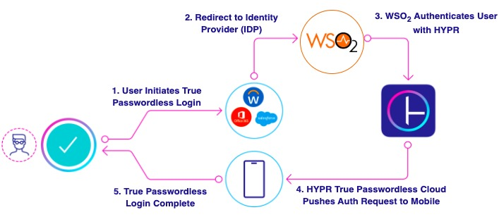

# HYPR Authenticator

User credentials and other shared secrets are more vulnerable to attacks because stealing passwords and logging in to 
systems is easier than hacking them.

Another problem with passwords is that they can be hard to remember, even for legitimate users. It is also easy to steal
and exploit passwords by credential harvesters and other bad actors.

Leveraging passwordless multi-factor authentication such as HYPR will help eliminate passwords for users and deliver 
faster login experiences. Therefore, this HYPR authenticator, which is configured as a federated authenticator in WSO2 
Identity Server, will allow users to authorize an authentication request using a dedicated mobile device while providing
a secure and convenient passwordless multi-factor authentication flow.

Once the device completes the authorization, it requests the WSO2 Identity Server to authenticate the user into the 
service they are attempting to access.

You can use the HYPR authenticator to authenticate HYPR users to sign in to your organization’s applications. This 
connector supports WSO2 IS from version 6.1.0 onwards.

The following diagram illustrates the authentication flow of the HYPR federated authenticator:

## Getting started
To get started with the authenticator, go to [Configuring the HYPR Authenticator](config.md).
Once you have completed your configurations, you can authenticate users using the HYPR authenticator.

## Technical workflow
To understand the underlying flow of the HYPR authenticator, see the
[Technical workflow of HYPR Authenticator](technicalworkflow.md)