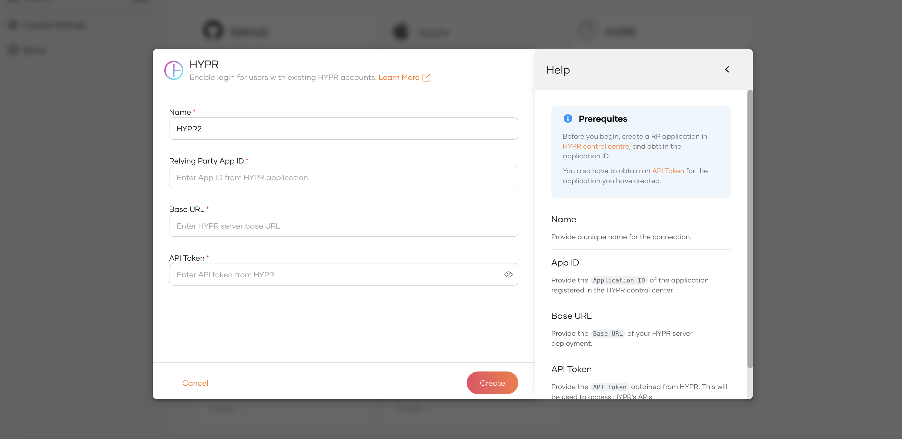

# Configuring the HYPR Authenticator
To use the HYPR authenticator with WSO2 Identity Server, first you need to configure  the authenticator with
WSO2 Identity Server. See the instructions given below on how to configure the HYPR authenticator with
WSO2 Identity Server using a sample app.

To test this approach, the user must first have an end-user account registered in the application created via the 
HYPR Control Center. The end user should have the HYPR mobile application installed on the smartphone, 
and the smartphone should be registered with the end user account.

After deploying the HYPR authenticator on WSO2 IS, the authenticator can be configured from the
WSO2 IS Console.

## Prerequisites
To use the connector, you'll need:

- A configured HYPR environment.
- A HYPR user account and mobile app to use for testing.

Note: Get the support from HYPR to configure a HYPR Application via the HYPR Control Center. You can also use the following [guide](configure_hypr.md) to help with your configurations.

## Setting up and installing the HYPR connector

**Step 1:** Extracting the project artifacts
1. Clone the `identity-outbound-auth-hypr` repository.
2. Build the project by running ```mvn clean install``` in the root directory.

Note : The latest project artifacts can also be downloaded from the Connector Store.

**Step 2:** Deploying the HYPR Authenticator

1. Navigate to `identity-outbound-auth-hypr/components` → `org.wso2.carbon.identity.application.authenticator.hypr` 
→ `target`.
2. Copy the `org.wso2.carbon.identity.application.authenticator.hypr-1.0.0-SNAPSHOT.jar` file.
3. Navigate to `<IS_HOME>/repository/components/dropins`.
4. Paste the `.jar` file into the dropins directory.
5. Alternatively, it's possible to drag and drop the `.jar` file to the dropins directory.
6. Next, navigate to `identity-outbound-auth-hypr/components` → 
`org.wso2.carbon.identity.application.authenticator.hypr.common` → `target`.
7. Copy the `org.wso2.carbon.identity.application.authenticator.hypr.common-1.0.0-SNAPSHOT.jar` file.
8. Navigate to `<IS_HOME>/repository/components/lib` directory and paste the `.jar` file.
9. Navigate to `identity-outbound-auth-hypr/components` → `org.wso2.carbon.identity.application.authenticator.hypr`
   → `src/main/resources/artifacts` and copy the `hypr` directory.
10. Paste it into `<IS_HOME>/repository/resources/identity/extensions/connections` directory.

**Step 3:** Deploying the HYPR REST API
1. Navigate to `identity-outbound-auth-hypr/components` → `org.wso2.carbon.identity.application.authenticator.hypr.rest` 
→`org.wso2.carbon.identity.application.authenticator.hypr.rest.dispatcher`→ `target`.
2. Copy the `api#hypr.war` file.
3. Navigate to `<IS_HOME>/repository/deployment/server/webapps`.
4. Paste the `.war` file into the webapps directory.
5. Next, navigate to `<IS_HOME>/repository/conf`.
6. Open the `deployment.toml` file.
7. Add the following lines of codes.
    ```toml
    [[resource.access_control]]
    context = "(.*)/api/hypr/v1/authentication/status/(.*)"
    secure = "false"
    http_method = "GET"
    
    [tenant_context]
    enable_tenant_qualified_urls = "true"
    enable_tenanted_sessions = "true"
    rewrite.custom_webapps=["/api/hypr/"]
    ```

**Step 4:** Deploying the HYPR login page
1. Copy `hyprlogin.jsp` in the downloaded artifacts.
2. Navigate to `<IS_HOME>/repository/deployment/server/webapps` → `authenticationendpoint`.
3. Paste or drop the `JSP` file in the `authenticationendpoint` directory.

## The WSO2 console's UI for the HYPR authenticator

The WSO2 Console's UI for the HYPR connector enables developers to easily configure HYPR
as an identity provider for their application. The UI offers a user-friendly and intuitive
interface for defining essential HYPR credentials, such as base URL, relying party app ID,
and API token.


With IS 7.0 and above you can use the react console and add new connection from connections page.



### Base URL
This refers to the Base URL you received from HYPR upon creating a tenant for your organization.
Example :
```
https://<organization name>.hypr.com
```

### Relying Party App ID
This refers to the App ID you received for the application you created in the HYPR Control Center.
Example :
```
<Application ID of the HYPR App>
```
Follow the steps given below to extract the App ID from the HYPR Control Center.
1. Navigate to the HYPR Control Central via the link provided to you from HYPR and log in using your HYPR credentials.
2. Select your app from the `Choose an App` drop-down list. Next you are navigated to the dashboard of the application. 
3. Finally, click **App Settings** in the upper-right corner and note down the `App ID`.

### API Token
This refers to a new API token that is specifically generated for the HYPR App via the Control Center.
Example :
```
<Generated API Token for the HYPR App>
```
Follow the steps given below to generate a new API token from the HYPR Control Center.
1. Navigate to the HYPR Control Central via the link provided to you from HYPR and log in using your HYPR credentials.
2. Select your app from the `Choose an App` drop-down list. Next, you are navigated to the dashboard of the application.
3. Under **Advanced Config**, click **Access Token** > **Generate Token**.
4. Finally, add a new name to your API token,  select **API Access Token** from the available list, and click 
**Create Token**.

## The HYPR authentication flow

The authentication flow for a user attempting to log in to a sample app (**PickUp Dispatch**) using HYPR is illustrated 
in the diagram below.

