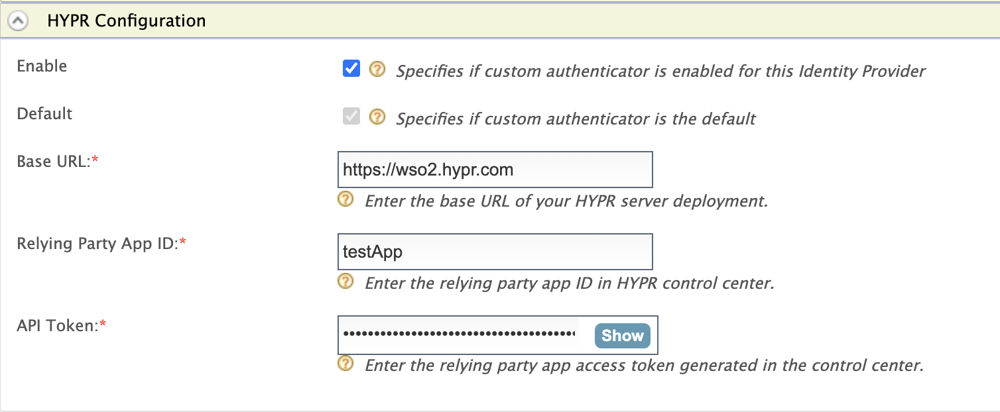
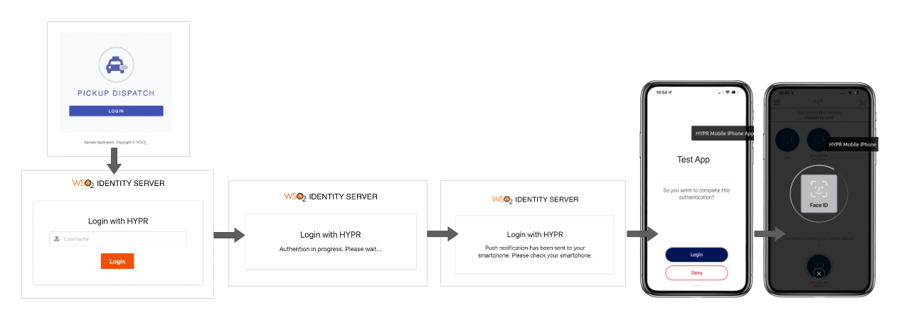

# Configuring the HYPR Authenticator
To use the HYPR authenticator with WSO2 Identity Server, first you need to configure  the authenticator with
WSO2 Identity Server. See the instructions given below on how to configure the HYPR authenticator with
WSO2 Identity Server using a sample app.

To test the approach, first an end-user account should be registered in the application created via the 
HYPR Control Center and the end user should have the HYPR mobile application installed in the smartphone, as well as 
the smartphone registered with the end user account.

After deploying the HYPR Authenticator to WSO2 IS, the Authenticator can be configured from the
WSO2 IS Console.

## Requirements
To use the connector, you'll need:

- A configured HYPR environment.
- A HYPR user account and mobile app to use for testing.

Note: Get the support from HYPR to configure a HYPR Application via the HYPR Control Center.

## Setting up and installing the HYPR connector

**Step 1:** Extracting the project artifacts
- Clone the `identity-outbound-auth-hypr` repository.
- Build the project by running ```mvn clean install``` in the root directory.

Note : The latest project artifacts can also be downloaded from the Connector Store.

**Step 2:** Deploying the HYPR Authenticator

- Navigate to `identity-outbound-auth-hypr/components` → `org.wso2.carbon.identity.application.authenticator.hypr` 
→ `target`.
- Copy the `org.wso2.carbon.identity.application.authenticator.hypr-1.0.0-SNAPSHOT.jar` file.
- Navigate to `<IS_HOME>/repository/components/dropins`.
- Paste the `.jar` file into the dropins directory.
- Alternatively it's possible to drag and drop the `.jar` file to the dropins directory.
- Next navigate to `identity-outbound-auth-hypr/components` → 
`org.wso2.carbon.identity.application.authenticator.hypr.common` → `target`.
- Copy the `org.wso2.carbon.identity.application.authenticator.hypr.common-1.0.0-SNAPSHOT.jar` file.
- Navigate to `<IS_HOME>/repository/components/lib` directory and paste the `.jar` file.

**Step 3:** Deploying the HYPR REST API
- Navigate to `identity-outbound-auth-hypr/components` → `org.wso2.carbon.identity.application.authenticator.hypr.rest` 
- →`org.wso2.carbon.identity.application.authenticator.hypr.rest.dispatcher`→ `target`.
- Copy the `api#hypr.war` file.
- Navigate to `<IS_HOME>/repository/deployment/server/webapps`.
- Paste the `.war` file into the webapps directory.
- Next navigate to `<IS_HOME>/repository/conf`.
- Open `deployment.toml` file.
- Add the following lines of codes.
```toml
[[resource.access_control]]
context = "(.*)/api/hypr/v1/authentication/status/(.*)"
secure = "false"
http_method = "GET"

[tenant_context]
enable_tenant_qualified_urls = "true"
enable_tenanted_sessions = "true"
rewrite.custom_webapps=["/api/hypr/"]
```

**Step 4:** Deploying HYPR login page
- Copy `hyprlogin.jsp` in the downloaded artifacts.
- Navigate to `<IS_HOME>/repository/deployment/server/webapps` → `authenticationendpoint`.
- Paste or drop the `JSP` file in the `authenticationendpoint` directory.


### _The WSO2 Console’s UI for HYPR authenticator section as follows_


#### Base URL
This refers to the Base URL  you received from the HYPR upon creating a tenant for your organization.
Example :
```
https://<organization name>.hypr.com
```

#### Relying Party App ID
This refers to the App ID you received for the application you created in the HYPR Control Center.
Example :
```
<Application ID of the HYPR App>
```
Follow the steps given below to extract the App ID From the HYPR Control Center.
- Navigate to the HYPR Control Central via the link provided to you from HYPR and log in using your HYPR credentials.
- Select your app from the `Choose an App` drop-down list. Next you are navigated to the Dashboard of the application. 
- Finally, click the App Settings in the top right corner. Note down the App ID.

#### API Token
This refers to an API token newly generated specifically for the HYPR App via the control center.
Example :
```
<Generated API Token for the HYPR App>
```
Follow the steps given below to generate a new API token from the HYPR Control Center.
- Navigate to the HYPR Control Central via the link provided to you from HYPR and log in using your HYPR credentials.
- Select your app from the `Choose an App` drop-down list. Next you are navigated to the Dashboard of the application.
- Under **Advanced Config**, click **Access Token** > **Generate Token**.
- Finally, add a new name to your API token,  select **API Access Token** from the available list, and click **Create Token**.

### _The HYPR authenticator's flow as follows_
