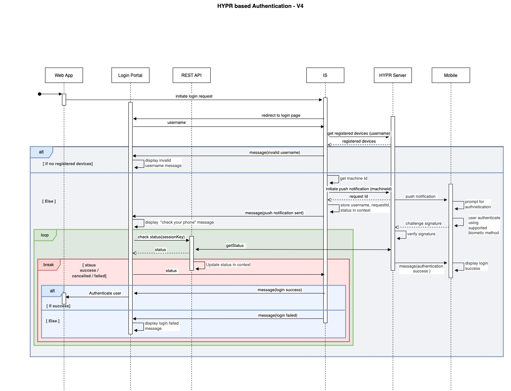

# Technical Workflow - HYPR Authenticator

Following is a high level architecture diagram of all the functionalities handled by the HYPR authenticator components
at different levels.

**The following sequence diagram shows how authenticator's login flow working.**

## Authenticator component
The HYPR authenticator component is responsible for handling a user’s authentication requests. Once the user selects the  
"Login with HYPR" option, the HYPR authenticator gets triggered as the initial component to start a request.

Once the authentication request is initialized at the server end, a request is sent to the HYPR server requesting 
to initiate the authentication via sending a push notification to the user registered mobile devices.
Once a push notification is sent to the registered user mobile device, the user authorizes or denies 
the request it’s received. To authorize, the user have to accept it and have to provide the biometrics verification. 
Simultaneously  a polling mechanism initiated from the frontend side checks regularly to validate if the user has 
responded to the request. Upon a successful authorization the user will be successfully login to the WSO2 Identity 
Server protected app and upon a failure user will be redirected back to the HYPR login page.

## REST API component
The REST API component handles the API request related to authentication. The operation covered is;
- Check the authentication status of the user.

### Sample request
Request used for authentication is as follows.

#### Authentication status check request
| GET          | https://{host}/api/hypr/v1/authentication/status/sessionDataKey={sessionDataKey}                                                                                                     |
|--------------|--------------------------------------------------------------------------------------------------------------------------------------------------------------------------------------|
| Purpose      | User authentication request status check                                                                                                                                             |
| Content Type | application/json                                                                                                                                                                     |
| Responses    | -                                                                                                                                                                                    |
| -----------  | ---                                                                                                                                                                                  |
| 200          | OK    { "sessionKey": "bf98f2b5caca07c703d2401f4298967d9829ded2978dffc04c4b95cf61f87a49" , "timestamp": "2023-01-09T06:06:42.410Z",  "status": "COMPLETED" } |
| 400          | Bad Request                                                                                                                                                                          |
| 500          | Internal Server Error                                                                                                                                                                |

